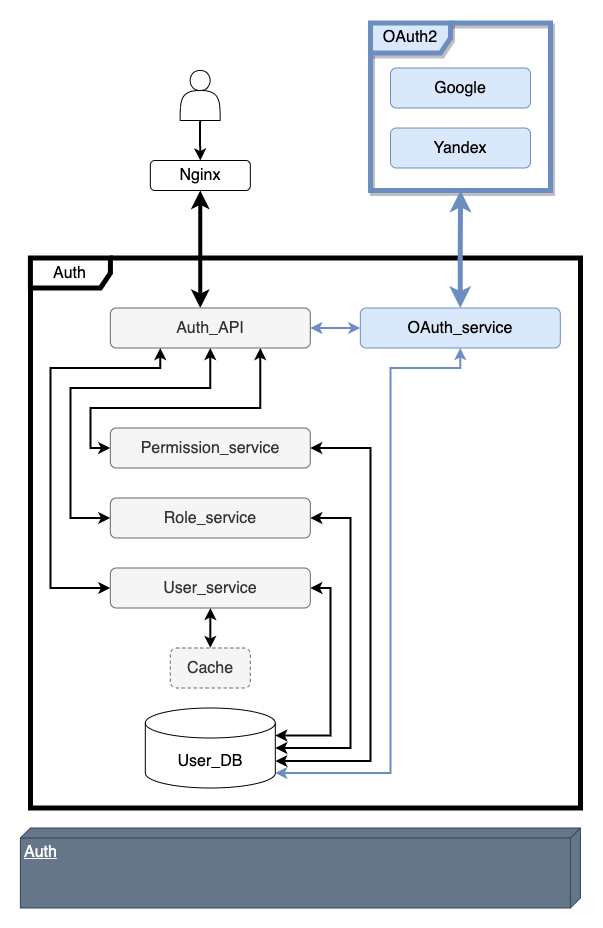

# OAuth api

Сервис авторизации, написанный с использованием библиотеки Flask, технологии авторизации OAuth2, технологии распределённой трассировки OpenTracing базы данных PostgreSQL

## Схема проекта



## Работа с проектом

### Запуск приложения auth локально
1. Установить зависимости командой
    ```$ poetry install```
2. Создать файл конфигурации ```.env``` в корне проекта и заполнить его согласно ```example.env ```
3. Загрузить приложение в переменную окружения командой
    ```$ export FLASK_APP=main.py```
4. Выполнить миграции командой
    ```$ flask db upgrade```
5. Создать администратора командой
    ```$ flask create_sudo <username> <email> <password>```
6. Заполнить БД данными командой
    ```$ flask create_tables```
7. Проект запускается командой
    ```$ python3 auth/wsgi.py```
8. Перейти к документации по url: ```http://localhost:5000/swagger/ ```

### Запуск приложения в docker
1. Создать файл конфигурации ```.env``` в корне проекта и заполнить его согласно ```example.env ```
2. Запустить контейнер командой
    ```$ docker-compose -f docker-compose.prod.yml up -d --build```
3. Перейти к документации по url: ```http://localhost:80/swagger/ ```
4. Перейти к Jaeger UI по url: ```http://localhost:16686/search ```

### Запуск тестов
1. Создать файл конфигурации ```.env``` в корне проекта и заполнить его согласно ```example.env ```
2. Запустить контейнер командой
    ```$ docker-compose -f docker-compose.test.yml up -d --build```
